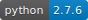

# Jerk Metrics

[](https://github.com/ipa-flg-ma/jerk_metrics)
[](https://github.com/ipa-flg-ma/jerk_metrics)

Writing a python programm to get the `/base/odometry_controller`-speed and use it for data analytics. Concerning max allowed jerk in velocity-profile.

## Usage
### Plots
All generated plots are saved as pdf-file for further usage. All plots are saved in subfolder `/Data/*Timestamp*` (folder is created automatically),
named according to plotted data including timestamp. See example:


### ROS Subscriber Support
Included subscriber to ROS-topic
```
/base/odometry_controller/
```

topic, of type `nav_msgs.msg` as `Odometry.msg`.
Access data via:
```python
data.header.seq
data.header.stamp
data.twist.twist.linear.x
data.twist.twist.linear.y
data.twist.twist.angular.z
data.pose.pose.position.x
data.pose.pose.position.y
```
`stamp` data is given in seconds and nanoseconds. Listener is wizard and calculates one time value.
```
data.header.stamp.secs
data.header.stamp.nsecs
```
**Attention**:
precision of header.stamp: 3.3f (`nsecs` doesn't provide more than milliseconds precision.
Example: `sec: 121 [s]` | `nsecs: 702000000 [ns]` --> `121.702000000 [s]`

Precision should be sufficient for differentiation, but nanoseconds are not really supported.

### .csv-Files
The collected data from the subscriber can be stored as a `.csv`-file, saved in subfolder `Data/*Timestamp*` (created
automatically), together with the plotted data. The `.csv`-file includes the smoothed acceleration and
smoothed jerk data, and is named like `%d_%m_%Y---%H:%M_*.**` where the last `*.**` is the length of the collected data
in seconds.

### Terminal
The follwing commandline arguments can be passed to `main.py`:

| Short |   Long   | Value | Description |
|:-----:|:--------:|:-----:|:-----------:|
| -h | --help | [FLAG] |show this help message and exit |
| -j JERK | --jerk JERK | JERK [int] |max allowed jerk for jerk metrics, default = 4.0 [m/s^3] |
| -s | --show_figures | [FLAG] |show generated plots |
| -t TOPIC | --topic TOPIC | TOPIC [str] |topic name to subscribe to, default: '/base/odometry_controller/odometry' |
| -csv LOAD_CSV | --load_csv LOAD_CSV | LOAD_CSV [str] |name and path to csv-file e.g.: '~/test.csv' |
| -bag LOAD_BAG | --load_bag LOAD_BAG | LOAD_BAG [str] |name and path to bag-file e.g.: '~/test.bag' |
| -rc | --read_csv | [FLAG] |if flag is true a csv-file is read, but it must be specified by `-csv` |
| -rb | --read_bag | [FLAG] |if flag is true a bag-file is read, but it must be specified by `-bag` |

Compare all jerk-data to maximum and give either passed or failed feedback (added terminal colour support: failed -- red | passed -- green)
```
-j 4.5 | --jerk 4.5
```
is setting
```
jerk_metrics(self, max_jerk=4.5)
```
in function. Max jerk value has to be determined empirically.

### Bandwidth
Max allowed jerk is given as bandwidth above which jerk should not go.


## History
**V 1.9.0:**
- `annotate_max` function implemented
- text box in plots is shown with `v` or `j` max values, and  `time` at which they occur

**V 1.8.1:**
- solved problem with existing directory if multiple bagfiles or csv-files were evaluated in short time
(i.e. timestamp hasn't changed since last evaluated file --> problem with creating directory because it already
exists).
- now possible to evaluated many bagfiles or csv-files in short time

**V 1.8.0:**
- data can now be collected directly from a `.bag`-file
- new terminal arguments for bagfile-support
- [terminal commands](https://github.com/ipa-flg-ma/jerk_metrics/tree/master#terminal)

**V 1.7.4:**
- csv-file now includes length in seconds in filename `%d.%m.%Y---%H:%M_*.**`
- directory `Data/Timestamp` now created automatically
- all files (plots and csv-files) now saved in `Data/Timestamp`-folder

**V 1.7.3:**
- csv-files now saved as dtype=float64 --> data fully available
- saved `smo_jerk` and `smo_acc` data in csv-file

**V 1.7.2:**
- [better terminal support ](https://github.com/ipa-flg-ma/jerk_metrics/tree/master#terminal)
- `topic` in `listener.py` can now be changed, default: `/base/odometry_controller/odometry`

**V 1.7.1:**
- new python file including colors for terminal output named `bcolors.py`
- `from bcolors import TerminalColors as tc` --> `tc.OKBLUE` shows blue ouptut
- added information on how to kill the `listener.py`-subscriber on function call
- changed timeformat from `%d.%m.%Y---%H:%M` to `%d_%m_%Y---%H:%M` for better implementation in Latex (dot is not supported in pdf-names)
- changed structure in chapter "HOW TO New Metric"

**V 1.7.0:**
- added function to store collected data in .csv-file
- save .csv-file with name convention: ```%d.%m.%Y---%H:%M```
  - %d: day
  - %m: month
  - %Y: full year
  - %H: hour
  - %M: minute
- minor improvements in class compatibility
- changed array datatype from ```dtype=np.double``` to ```dtype=np.float64```
- `listener.py`-callback now only shows every 25 newly collected rows a console output
  - sentence output added to kill waiting time


**V 1.6.2:**
- added minor improvements

**V 1.6.1:**
- bug fixing (time calculating bug because of nanoseconds in timestamp)

**V 1.6.0:**
- added full rostopic subscriber support

**V 1.5.3:**
- added full terminal support. Command-line arguments now supported, such as
```
-jerk=4.5
```
- Improved terminal output for 'jerk_metrics'-function (now in fancy colours)

**V 1.5.2:**
- code cleanup
- added bandwith support
- added 'jerk_metrics'-function
- made 'main.py' executable

**V 1.5.0:**
- added one figure support
- added smoothing for data

# HOW-TO New Metric
The following steps are needed to implement a new metrics in ATF:
### Python File
- Create new python-file for the metrics, using the following nameconvention:
```
calculate_*name*.py
```
- copy existing structure from one of the implemented metrics, looking like:
```python
class CalculatePublishRateParamHandler
    def parse_parameter(self, testblock_name, params):
class CalculatePublishRate:
    def __init__(self, groundtruth, groundtruth_epsilon):
    def start(self, timestamp):
    def stop(self, timestamp):  
    def pause(self, timestamp):
    def purge(self, timestamp):   
    def get_result(self):
```
  using the "publish\_rate"-metrics as an example. Replace "PublishRate" with the name of your newly generated metrics.
- In file ```atf/src/atf/atf_metrics/src/atf_metrics/__init__.py``` add:
```python
from atf_metrics.calculate_*name* import Calculate*Name*, Calculate*Name*ParamHandler
```
  e.g.
```python
from atf_metrics.calculate_jerk import CalculateJerk, CalculateJerkParamHandler
```
  here *name* stands for the name of your new metric (obviously).

- In file ```atf/src/atf/atf_metrics/config/metrics.yaml``` add:
```
*name*:
   handler: Calculate*Name*ParamHandler
```
  e.g.
```
jerk:
  handler: CalculateJerkParamHandler
```
### ATF Presenter
- In file ```atf/atf_presenter/html/js/atf_tools/test_list.js``` add (using "jerk" as an example):
```javascript
var plot_options = {
      jerk: {
        chart: {
          defaultSeriesType: 'column',
          type: 'column',
          zoomType: 'xy'
        },
        title: {
          text: 'Jerk'
        },
        yAxis: {
          title: {
            text: 'Jerk [m/s^3]'
          }
        },
        xAxis: {
          labels: {
            enabled: false
          }
        },
        plotOptions: {},
        tooltip: plot_tooltip
      },
};
```
  search the following if-statement:
```javascript
if ((metric_name == 'time') || (metric_name == 'path_length') || (metric_name == 'publish_rate') || (metric_name == 'interface') || (metric_name == 'jerk'))
```
  and add the new metrics as ```|| (metric_name == '*name*')```. In the following lines...
```javascript
if (metric_name == 'path_length') chart_legend_name = testblock_name + "<br>(" + metric_data['details']['root_frame'] + " to " + metric_data['details']['measured_frame'] + ")"
if (metric_name == 'publish_rate') chart_legend_name = testblock_name + "<br>(" + metric_data['details']['topic'] + ")"
if (metric_name == 'interface') chart_legend_name = testblock_name + "<br>(" + metric_data['details'] + ")"
if (metric_name == 'jerk') chart_legend_name = testblock_name + "<br>(" + metric_data['details']['topic'] + ")"
```
  add...
```javascript
if (metric_name == '*name*') chart_legend_name = testblock_name + "<br>(" + metric_data['details'] + ")"
```
To get additional information in the presenter. The "details" you store in the "metrics\_data" will be shown below the metrics-name in brackets.

# Setting up new ATF test
Generate a new ATF test following these steps:
1. generate project with the following structure:
```
test_project/
├── CMakeLists.txt
├── config
│   ├── robot_envs
│   │   └── env1.yaml
│   ├── robots
│   │   ├── robot1.yaml
│   │   └── robot2.yaml
│   ├── test_configs
│   │   ├── test1.yaml
│   │   └── test2.yaml
│   ├── test_generation_config.yaml     # specifies how to generate test files
│   └── test_suites.yaml                # specifies the combination of test_configs, robots and robot_envs.
├── launch
│   └── application.launch              # add all launch files that you want to run additionally to your robot bringup like moveit, etc...
├── package.xml
└── scripts
    └── application.py                  # send navigation goal to the robot
```

 - robot_envs:
   directory for environment specific settings, each environment is configured in one <robot_env_name>.yaml file
    (e.g. `env1.yaml`)
 - robots:
   directory for robot specific settings, each robot is configured in one <robot_name>.yaml file
    (e.g. `robot1.yaml`)
 - test_configs:
   directory for test configurations, each test is configured in one <test_config_name>.yaml file
   (e.g. `test1.yaml`)
 - `application.launch`:
   `launch`-file includes information about the ROS configs (e.g. 'saturn-ingolstadt' or 'ipa-apartment' environment config),
   and includes gazebo and RVIZ startup

2. config:
  - robot_envs:
```yaml
additional_parameters: {}                                # Name and value of additional parameter which will be included in every recording test file
additional_arguments: {}                                 # Name and value of additional arguments which will be included in every recording test file
```
  - robots:
```yaml
goal:                                          
  topics:                                             # Topics for the metric 'goal'
    - "/base_pose_ground_truth"
    - "/move_base/goal"
wait_for_topics: [/move_base/status]                  # Names of the topics to wait for before beginning the test
wait_for_services: []                                 # Names of the services to wait for before beginning the test
additional_parameters: []                             # Name and value of additional parameter which will be included in every recording test file
additional_arguments: []                              # Name and value of additional arguments which will be included in every recording test file

```
   In the `robot1.yaml` you can define topics which are included when the corresponding metric (e.g. "goal") is running
   (i.e. topics you need to **collect data** from for further calculations).

  - test_configs:
```yaml
testblock_nav:

  goal:
    - topic: /move_base/goal
      groundtruth: 0.2
      groundtruth_epsilon: 20

  jerk:
    - topic: /base/odometry_controller/odometry
      groundtruth: 0.0
      groundtruth_epsilon: 4.0

  time:
    - groundtruth: 6.0
      groundtruth_epsilon: 4.0

  publish_rate:
    - topic: /base/odometry_controller/odometry
      groundtruth: 33
      groundtruth_epsilon: 5
```
  In the `test1.yaml` you define the different metrics, the groundtruth and groundtruth epsilon for those metrics,
  and the topics (if necessary). All the chosen metrics are applied in *one* test-run of ATF.
  You can add additional parameters to extend the provided information for the metrics:
```yaml
testblock_nav:

  goal:
    - topic: /move_base/goal
      groundtruth_angle: 0.0 # [degree]
      groundtruth_angle_epsilon: 20.0 # [degree]
      groundtruth: 0.0 # [m]
      groundtruth_epsilon: 0.2 # [m]
```
  Those additional parameters have to be collected in the `metrics.py`-file using the following line:
```python
    def parse_parameter(self, testblock_name, params):

    [...]

        metrics.append(CalculateGoal(metric["topic"],
                                     metric["groundtruth_angle"],           # added in 'test.yaml' config in 'test_configs'
                                     metric["groundtruth_angle_epsilon"],   # added in 'test.yaml' config in 'test_configs'
                                     groundtruth,
                                     groundtruth_epsilon))
```

  | Name | Definition |
  |:------------:|:---------------:|
  | groundtruth |defines the expected value, example: 5 [m]
  | groundtruth_epsilon |defines max allowed +/- for the groundtruth, example: +/- 0,1 [m] |
  | topic |defines subscribed topic |
